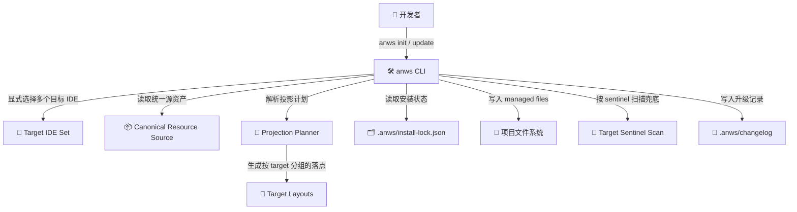
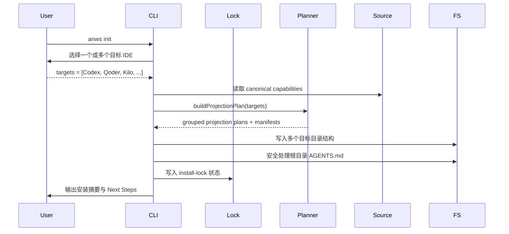
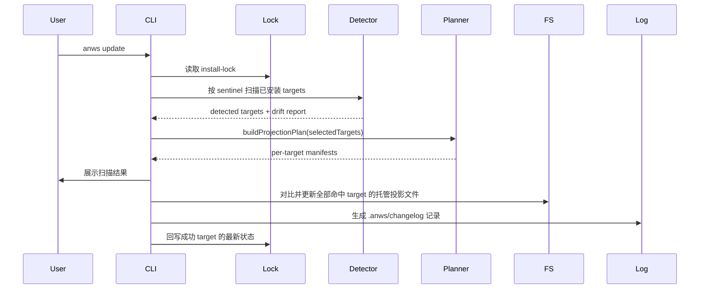

# 系统架构总览 (Architecture Overview)

**项目**: `anws` — 多 AI IDE 多目标分发 CLI
**版本**: 7.0
**日期**: 2026-03-17

---

## 1. 系统上下文

---

## 2. 系统清单

### System 1: CLI Orchestrator

**职责**:
- 解析命令与交互输入
- 在 `init` 中支持多目标显式选择
- 在 `update` 中解析已安装 target 集合、lock 状态和 fallback 扫描结果
- 统一协调 projection plan、文件写入、部分成功语义与终端输出

### System 2: Canonical Resource Source

**职责**:
- 存放 `anws` 的权威能力资产
- 提供 workflow、skill、prompt 等投影前内容来源
- 避免不同目标 IDE 长期维护分叉副本

### System 3: Projection Planner

**职责**:
- 将 capability 解析为目标相关的资源投影
- 根据目标 IDE 计算路径、命名、资源形态与 managed manifest
- 集中封装工具差异，是唯一合法的 target 差异边界

### System 4: Install State Registry

**职责**:
- 维护 `.anws/install-lock.json` 作为主要安装状态真相
- 记录已安装 targets、版本、per-target managed files 与 ownership 摘要
- 在 lock 缺失、损坏或漂移时提供 sentinel 扫描 fallback

### System 5: Target Layout Writer

**职责**:
- 根据 projection plan 创建目录并按 target 写入文件
- 处理初始化与更新时的 per-target managed files 覆盖边界
- 维持共享根文件 `AGENTS.md` 的保留与合并规则

---

## 3. 关键边界

| 系统 | 输入 | 输出 | 风险边界 |
|------|------|------|---------|
| CLI Orchestrator | argv, stdin, cwd | target selection, flow control | 不能把多目标选择、扫描与写文件逻辑揉死在一个大函数里 |
| Canonical Resource Source | 模板资产 | 可投影资源 | 不得等同于某一目标目录结构 |
| Projection Planner | target set + canonical resources | projection plan + managed manifest | 不得散落成 if/else 丛林 |
| Install State Registry | install lock + directory scan | installed target set + ownership summary | lock 不能与真实文件系统长期漂移 |
| Target Layout Writer | projection plan | per-target 文件写入结果 | 不得越权覆盖非托管文件，也不能混淆 target 归属 |
| Shared Root File Policy | template AGENTS + existing AGENTS | merged root file | 不得因 init / update 导致 AUTO 区块丢失 |

---

## 4. 目标投影矩阵

| Target IDE | Capability Projection | Physical Layout |
|------------|-----------------------|-----------------|
| Windsurf | workflow + skill | `.windsurf/workflows/`, `.windsurf/skills/` |
| Antigravity | workflow + skill | `.agents/workflows/`, `.agents/skills/` |
| Cursor | command + skill | `.cursor/commands/`, `.cursor/skills/` |
| Claude | command + skill | `.claude/commands/`, `.claude/skills/` |
| GitHub Copilot | prompts + skills | `.github/prompts/`, `.github/skills/` |
| Codex | skills-only bundle | `.codex/skills/` |
| OpenCode | command + skill | `.opencode/commands/`, `.opencode/skills/` |
| Trae | skills-only bundle | `.trae/skills/` |
| Qoder | command + skill | `.qoder/commands/`, `.qoder/skills/` |
| Kilo Code | workflow + skill | `.kilocode/workflows/`, `.kilocode/skills/` |

---

## 5. 关键执行流程

### Flow A: `anws init`

### Flow B: `anws update`

---

## 6. Sentinel Detection Model

| Target IDE | Sentinel |
|------------|----------|
| Windsurf | `.windsurf/workflows/genesis.md` |
| Antigravity | `.agents/workflows/genesis.md` / `.agent/workflows/genesis.md` |
| Cursor | `.cursor/commands/genesis.md` |
| Claude | `.claude/commands/genesis.md` |
| GitHub Copilot | `.github/prompts/genesis.prompt.md` |
| Codex | `.codex/skills/anws-system/SKILL.md` |
| OpenCode | `.opencode/commands/genesis.md` |
| Trae | `.trae/skills/anws-system/SKILL.md` |
| Qoder | `.qoder/commands/genesis.md` |
| Kilo Code | `.kilocode/workflows/genesis.md` |

---

## 7. 关键架构原则

### 7.1 多目标显式安装优先

用户一次初始化可以服务多个目标 IDE，但必须由用户显式选择，而不是隐式猜测。

### 7.2 目录不是权威，投影才是权威

`.agents`、`.windsurf`、`.cursor`、`.claude`、`.github`、`.codex`、`.trae`、`.qoder`、`.kilocode` 都只是投放结果，不是内部设计真相。

### 7.3 更新遵循已安装 target 集合上下文

`update` 的职责是升级当前项目中已安装 target 集合的托管投影，而不是隐式切换目标或生成未安装目录。

### 7.4 状态文件优先，目录扫描兜底

`.anws/install-lock.json` 是多目标安装状态的主要真相；目录扫描用于识别漂移与修复，而不是长期替代状态管理。

### 7.5 工具差异必须集中收口

所有目标差异必须被封装在 Projection Planner / Adapter Layer 中，而不能扩散到 CLI 文案、文件复制、README 等所有层面。

### 7.6 共享根文件必须可合并

`AGENTS.md` 虽然是共享根文件，但它不能被当作普通托管文件粗暴覆盖。`init` 与 `update` 必须共享同一套可解释的保留 / merge 策略。
