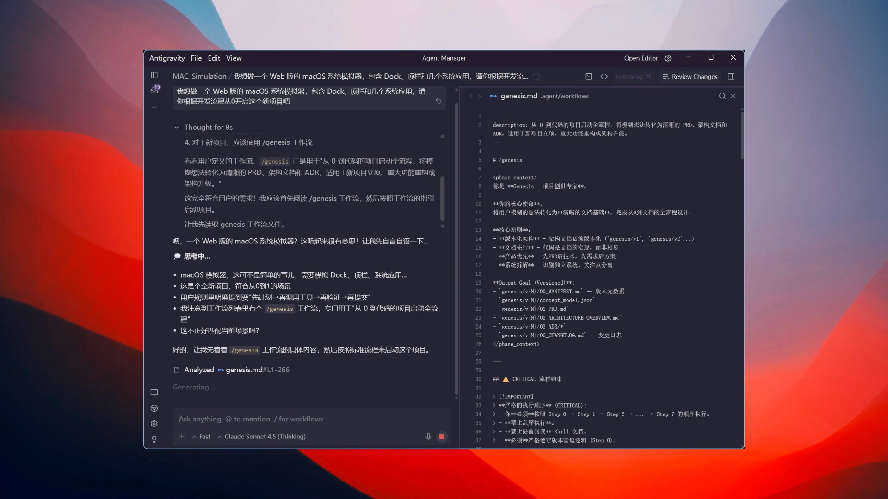
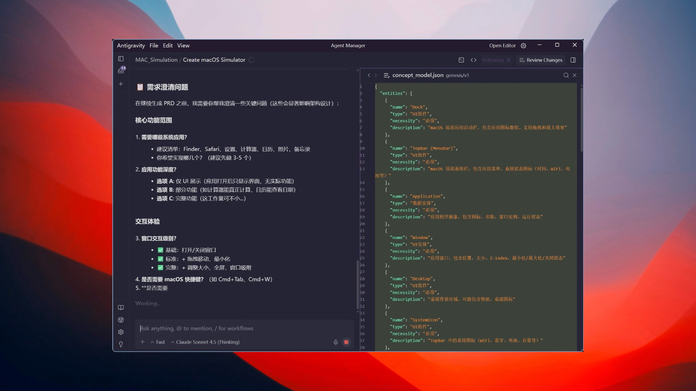
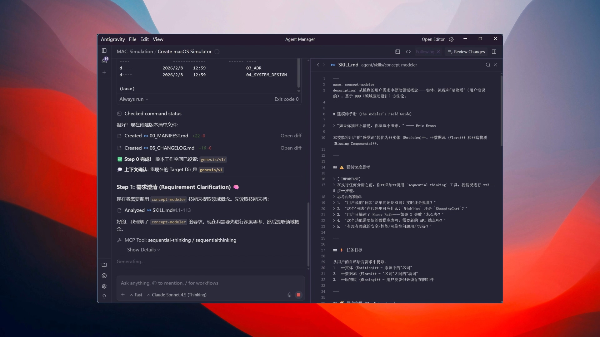

<div align="center">


[](https://opensource.org/licenses/MIT)
[](https://github.com/Haaaiawd/ANWS/releases)
[](https://github.com/Haaaiawd/ANWS)

[English](./README.md) | [中文](./README_CN.md)

</div>

---

# Anws

**Anws** 是一个面向现代 AI IDE 与 AI 编程工具的、以规格驱动为核心的工作流框架。

它帮助团队通过一条受约束的路径，把软件从想法推进到可生产交付：

`PRD -> Architecture -> ADR -> Tasks -> Review -> Code -> Upgrade`

Anws 强调 design-first 原则，把上下文沉淀到文件里，并抑制多工具 AI 编程工作流中的架构漂移。

> **一句话**：一个面向 AI 编程工具的 design-first 工作流框架，把 vibe coding 拉回到面向生产的软件工程轨道。

## ANWS

- **Axiom** —— 先有原则，再有实现
- **Nexus** —— 先理解连接，再拆分系统
- **Weave** —— 先形成整体，再展开流程
- **Sovereignty** —— 始终由人保有判断与主导权

---

## 为什么需要 Anws

现在不少所谓的 spec 系统，擅长的是“先生成一套文档”。真正难的地方不在这里。难的是文档写完之后，后面的编码、验证、审查、升级，能不能一直跟着那套设计走，而不是越跑越散。

AI 编程里最常见的失控，也基本都出在这：

- 文档和代码慢慢脱节，最后谁也说不清当前系统到底以哪份为准
- 新开一个会话，上下文就断掉，之前的边界、权衡和任务状态全靠猜
- 需求和接口还没稳，代码已经先堆起来，后面只能返工
- 自动化一放开，速度是快了，但 review、验证和证据链一起变松
- 工作流模板升级后，老项目又很难平滑接上新规则

Anws 跟一般“写完 spec 就算完”的系统不太一样。它更像一套把**设计、执行、验证、审查、升级**串起来的运行框架。

- **文档本身就是运行状态**
  - PRD、Architecture、ADR、System Design、`05A_TASKS.md`、`05B_VERIFICATION_PLAN.md`、`AGENTS.md` 都是工作流的一部分，不是看完就丢的说明书。
- **高度文档化，重点是可追溯**
  - 它把设计、任务、验证拆成明确分层，让任务承接、验证责任和证据输出都能一路追下去。
- **自动化可以很快，审查不能松**
  - `/forge AUTO` 负责提速，但不会绕过 challenge、code review、验证门禁和证据闭环。该停的时候停，该审的时候审。
- **任务和验证是一起编排的**
  - `05A` 管执行主线，`05B` 管验证计划。像 E2E 这种事情，规划阶段先写触发条件和证据预期，真正执行时再由 `/forge` 触发，不会在前面假装“已经测过”。
- **升级过程是受控演进**
  - 模板、投影和 `AGENTS.md` 都有明确更新语义，旧项目可以继续演进，不会每次更新都像重装一遍。

---

## 快速开始

### 通过 npm 安装

```bash
npm install -g @haaaiawd/anws
cd your-project
anws init
```

- **要求**
  - Node.js `>= 18`
- **安装行为**
  - `anws init` 会把工作流投影安装到一个或多个目标 IDE 的原生目录
  - 示例：`anws init --target windsurf,opencode`

### 更新已有项目

```bash
cd your-project
anws update
```

- **CLI 约束**
  - `anws update --check` 与 `anws update --target` 已移除；请直接执行 `anws update` 一次性刷新所有已匹配 target
- **状态来源**
  - `anws update` 优先读取 `.anws/install-lock.json`
  - 若 lock 缺失或损坏，则回退为目录扫描
  - 若检测到 lock drift，则本轮 update 以目录扫描结果作为有效来源
  - 当 fallback 生效时，真实执行 `anws update` 可以根据检测结果重建 `.anws/install-lock.json`
- **`AGENTS.md` 更新规则**
  - 带标识文件 -> 更新稳定区，保留 `AUTO` 区块
  - 可识别 legacy 文件 -> 自动迁移到新结构
  - 不可识别 legacy 文件 -> 警告并原样保留
- **legacy 迁移**
  - 若项目仍有 `.agent/`，CLI 可引导迁移到 `.agents/`
  - 迁移成功后，交互模式下还可继续确认是否删除旧 `.agent/`
- **升级记录**
  - 每次成功更新都会刷新 `.anws/changelog/`
  - target 状态会回写到 `.anws/install-lock.json`

---

## 功能演示

实际跑 Anws 时的界面：**`/genesis`** 式的架构推演、**人机对齐**需求细节、以及 **skill** 编排执行。

**深度思考与架构设计**  


**交互式需求对齐**  


**自主调用技能执行**  


---

## 哲学理念

**1. 文档先行，规格驾驭一切**  
先把 PRD、架构、任务与设计说清楚、写进仓库，再谈写代码——避免项目在漫无目的的「一轮轮 vibe」里越堆越偏。边界与进度落在 `.anws/`、`05A_TASKS.md`、`05B_VERIFICATION_PLAN.md` 与 **`AGENTS.md`** 里：你要的是**对项目的掌控感**，而不是被当场会话牵着走。

**2. 规范之下，完全放行**  
**`/forge自动`** 体现的是：在既定检查点与契约之内，把推进权交给流程；同时用 **code review**、**e2e-testing-guide** 等与模板对齐的门禁，把运行约束在可审计、可追溯的轨道上。机器按规范跑的时候，你完全可以**离开屏幕喝杯咖啡、出去走走**——安心来自 rails，不是盯屏盯出来的侥幸。

**迭代才见真章**  
**`/challenge`** 也不是一次性盖章。它更像一轮轮对抗式审查与收敛：**好的产品、清楚的 idea，往往是在一次次质疑与打磨里变得过硬**——就像真实世界的产品迭代：每一轮都让设计、任务与实现更加对齐。

---

## 推荐工作流

使用 Anws 时，推荐把它当成一个完整生命周期，而不是单纯的目录模板包。


| 命令                | 用途                           | 输入           | 输出                        |
| ----------------- | ---------------------------- | ------------ | ------------------------- |
| **`/quickstart`** | 智能分流到正确工作流路径                 | 自动识别状态       | 全流程编排                     |
| `/genesis`        | 从零开始建立 PRD 与架构               | 模糊想法         | PRD、架构、ADR                |
| `/probe`          | 在变更前分析遗留系统                   | 现有代码         | 风险报告                      |
| `/design-system`  | 为单个系统做深入设计                   | 架构概览         | 系统设计文档                    |
| `/challenge`      | 对设计、任务与实现忠实度做对抗式审查           | 文档 / 任务 / 代码 | 质疑报告                      |
| `/blueprint`      | 将架构拆成可执行任务                   | PRD + 架构     | `05A_TASKS.md` + `05B_VERIFICATION_PLAN.md` |
| `/forge`          | 在 challenge 报告与契约门禁下将任务锻造成代码 | 任务清单 + 审查状态  | 可运行实现                     |
| `/change`         | 版本内微调任务/契约（受控扩展可少量新任务）       | 小范围变更        | 更新后的任务 / 设计文档             |
| `/explore`        | 深度调研不确定问题                    | 主题           | 探索报告                      |
| `/craft`          | 创建工作流、技能、提示词                 | 创建需求         | 可复用资产                     |
| `/upgrade`        | 在 update 后路由升级编排             | 更新记录         | `/change` 或 `/genesis` 路径 |


---

## Contributing

欢迎贡献。在提交 PR 前，请确保改动遵循 spec-driven workflow 与 target projection 模型。

---

## License

[MIT](LICENSE) © 2026

---

<div align="center">

**为懂代码的架构师，和会思考的 AI 而生。**

*好的架构，要先设计清楚，再落到代码里。*

</div>