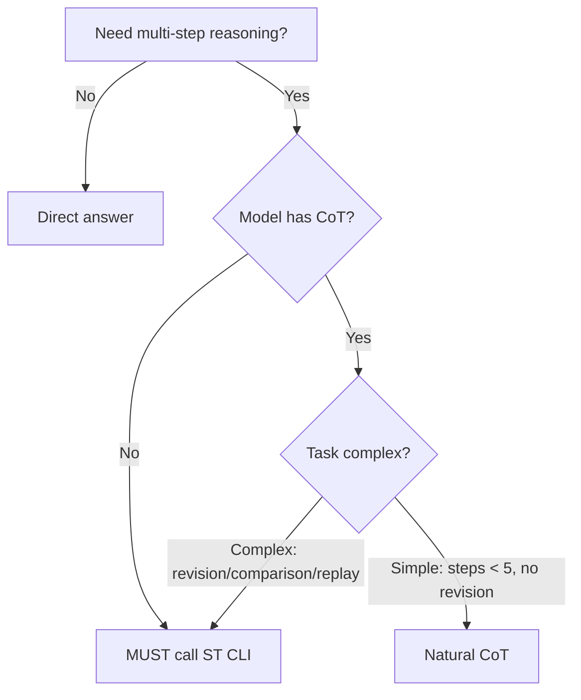

# Release Notes

## v2.0.5 (2026-03-20)

### 🎯 Highlights

This release focuses on **workflow reliability improvements** - addressing AI agent tendencies to skip complex skill calls and clarifying when to use deep thinking tools.

---

### 🔧 Probe Workflow Refactor

**Problem**: AI agents were skipping `nexus-mapper` and `runtime-inspector` skill calls because the original design required full PROBE protocol execution upfront.

**Solution**: Dual-level detection with strong constraints.

| Level | Trigger | Skills Called | Output |
|:-----:|---------|---------------|--------|
| **Light** | Default | `nexus-query` + `runtime-inspector` | Precise queries + process boundaries |
| **Deep** | `/probe --deep` or project > 100 files | `nexus-mapper` + `runtime-inspector` | Full `.nexus-map/` knowledge base |

**Strong Constraints**:
- ❌ Forbidden to skip skill calls and write report directly
- ❌ Forbidden to use "directory scan" as substitute for nexus-query
- ✅ Must execute at least light-level detection
- ✅ runtime-inspector is mandatory in both levels

---

### 🧠 Sequential-Thinking Repositioning

**Problem**: Workflows were mandating `sequential-thinking` CLI calls even for simple tasks, causing AI to either skip the entire workflow or make superficial calls.

**Solution**: Conditional trigger based on model capability and task complexity.

**Core Decision Rule**:

| Model Capability | Simple Task | Complex Task |
|-----------------|:-----------:|:-----------:|
| **No CoT** | MUST call ST CLI | MUST call ST CLI |
| **Has CoT** | Natural CoT | Call ST CLI |

**Decision Tree**:

**Mnemonic**: "No CoT → MUST use ST; Has CoT → Complex only use ST"

---

### 🔍 Explore Trigger Clarification

**Problem**: AI agents didn't know when to trigger `/explore`, leading to either overuse (slowing down flow) or underuse (missing research phase).

**Solution**: Explicit trigger conditions.

**Triggers**:
- User explicitly says "research", "explore", "tech selection", "brainstorm"
- `design-system` Step 3 auto-calls (research best practices)
- `genesis` Step 3 tech selection (optional)

**No-Trigger**:
- User says "start design", "write code", "implement feature"
- Not recommended in `quickstart` flow
- Simple questions (single-step answer)

**Note**: `/explore` is an independent workflow, not in quickstart main flow.

---

### 🐛 Other Fixes

- **ADR Reference Format**: Unified to `ADR_XXX_*.md` (underscore), consistent with genesis
- **ST References Updated**: `design-system.md`, `challenge.md`, `forge.md`, `runtime-inspector/SKILL.md`

---

### 📦 New Skill: nexus-query

A lightweight alternative to `nexus-mapper` for quick code structure queries.

**When to Use**:
- "What classes/methods does this file have?"
- "Who imports this module?"
- "What's the impact radius of this change?"
- "Which module is the high-coupling hotspot?"

**When NOT to Use**:
- Need full `.nexus-map/` knowledge base → use `nexus-mapper`
- No shell execution capability
- No Python 3.10+ locally

---

### 📊 File Changes

| File | Changes | Description |
|------|:-------:|-------------|
| `workflows/probe.md` | +140/-72 | Dual-level detection refactor |
| `skills/sequential-thinking/SKILL.md` | +51 | Repositioning with decision tree |
| `workflows/explore.md` | +50 | Trigger conditions |
| `workflows/design-system.md` | +19 | ST conditional references |
| `workflows/challenge.md` | +13 | ST conditional references |
| `workflows/forge.md` | +7 | ST conditional references |
| `workflows/blueprint.md` | +10 | ADR format unification |
| `workflows/quickstart.md` | +2 | Explore independence note |
| `skills/runtime-inspector/SKILL.md` | +10 | ST conditional references |
| `skills/nexus-query/*` | +new | Lightweight code query skill |

---

### 🚀 Upgrade Guide

No breaking changes. Existing workflows continue to work.

**Recommended Actions**:
1. Review updated `probe.md` for dual-level detection
2. Check `sequential-thinking/SKILL.md` for new decision rules
3. Update team documentation if referencing ADR format

---

## Previous Releases

### v2.0.4
- Bug fixes and documentation improvements

### v2.0.0
- Initial public release
- Core workflow system: genesis, blueprint, forge, probe, explore, challenge, quickstart
- Skill framework: sequential-thinking, nexus-mapper, runtime-inspector, etc.
