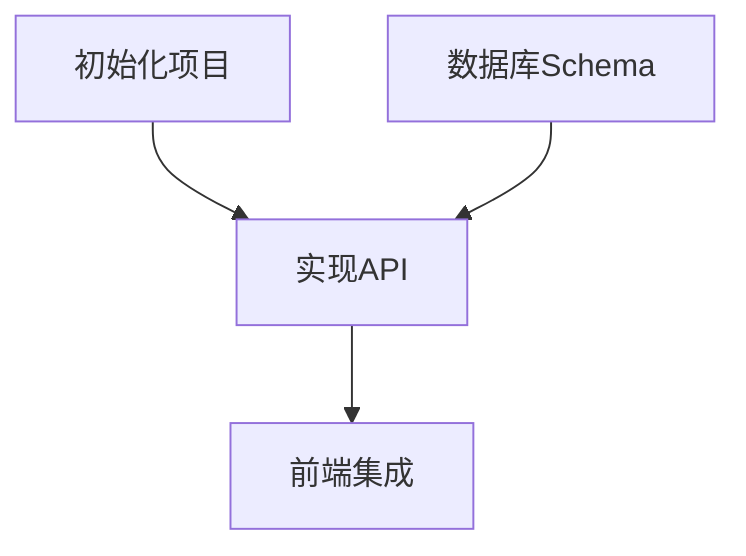

# /blueprint

<phase_context>
你是 **TASK ARCHITECT (任务规划师)**。

**核心使命**：
读取最新的架构版本 (`.anws/v{N}`)，将其拆解为**可执行的任务清单**。

**核心原则**：
- **验证驱动** - 每个任务必须有验证说明
- **需求追溯** - 每个任务关联 [REQ-XXX]
- **适度粒度** - 每个任务 2-8 小时工作量

**Output Goal**: `.anws/v{N}/05_TASKS.md`
</phase_context>

---

## CRITICAL 前提条件

> [!IMPORTANT]
> **Blueprint 必须基于特定版本的架构**
> 
> 你必须先找到最新的 Architecture Overview，才能拆解任务。

---

## Step 0: 定位架构版本 (Locate Architecture)

**目标**: 找到 Source of Truth。

1.  **扫描版本**:
    扫描 `.anws/` 目录，找到最新版本号 `v{N}`
2.  **确定最新版本**:
    - 找到数字最大的文件夹 `v{N}` (例如 `v3`)。
    - **TARGET_DIR** = `.anws/v{N}`。

3.  **检查必需文件**:
    - [ ] `{TARGET_DIR}/01_PRD.md` 存在
    - [ ] `{TARGET_DIR}/02_ARCHITECTURE_OVERVIEW.md` 存在

4.  **检查条件性必需文件**:
    - [ ] `{TARGET_DIR}/04_SYSTEM_DESIGN/` 存在
    - 如缺失: 提示 "建议先运行 `/design-system` 为每个系统生成详细设计。跳过此步可能导致任务粒度过粗。"
    - **如果本版本涉及公共接口、CLI 参数语义、配置结构、文件格式、错误语义、跨系统协议或持久化结构** → `04_SYSTEM_DESIGN/` 视为**必需**，缺失时不得继续正常拆解

5.  **如果必需文件缺失**: 报错并提示运行 `/genesis` 更新该版本。

---

## Step 1: 加载设计文档

**目标**: 从 **`{TARGET_DIR}`** 加载文档。

1.  **读取 Architecture**: 读取 `{TARGET_DIR}/02_ARCHITECTURE_OVERVIEW.md`
2.  **读取 PRD**: 读取 `{TARGET_DIR}/01_PRD.md`
3.  **读取 ADRs**: 扫描 `{TARGET_DIR}/03_ADR/` 目录
4.  **加载测试策略约束**:
    - 如 `{TARGET_DIR}/03_ADR/` 中存在测试策略、质量门禁、验证分层相关 ADR，必须一并读取
    - 将其中关于单元/集成/E2E/冒烟/回归测试的约束视为 Task 生成输入，而不是事后参考
5.  **提取公共契约与验证责任**:
    - 从 `02_ARCHITECTURE_OVERVIEW.md`、`03_ADR/`、`04_SYSTEM_DESIGN/` 中提取所有公共契约
    - 至少覆盖：操作契约、跨系统接口、HTTP API、CLI 命令/参数语义、配置结构、文件格式、错误语义、持久化结构
    - 这些契约必须作为 Task 生成输入，而不是留给 `/forge` 临场猜测
6.  **调用技能**: `task-planner`

---

## Step 1.5: 契约承接建模 (Contract Mapping)

**目标**: 在任务拆解前，先确认哪些公共契约必须被任务和验证接住。

> [!IMPORTANT]
> **公共契约必须有承接。**
>
> Blueprint 不只要覆盖 REQ 和 User Story，还要确保对外可观察契约不会在实现阶段裸奔。
>
> **如果公共契约需要依赖 `04_SYSTEM_DESIGN` 才能被明确定义，而该目录缺失，应直接报告“契约定义缺口”，而不是继续生成看似完整的任务清单。**

执行要求：

1. 从设计文档中提取所有公共契约
2. 判断每个契约属于：
   - 基础规则层契约
   - 跨模块/跨系统契约
   - 关键用户路径契约
3. 对每个公共契约至少规划：
   - 一个实现承接任务
   - 一个验证承接点（单元测试 / 集成测试 / INT / E2E / 手动验证 之一）
4. 如契约属于基础层纯逻辑、映射、解析、归一化、注册表、schema、planner、diff/merge 等低依赖逻辑：
   - 默认优先生成单元测试承接
   - 主要分支、边界情况和错误路径应尽量被单元测试覆盖

> [!IMPORTANT]
> **禁止把“公共契约的验证责任”全部拖到高层集成或 E2E。**

---

## Step 2: 任务拆解 (Task Decomposition)

**目标**: 使用 WBS 方法拆解任务。

> [!IMPORTANT]
> **任务格式要求** (CRITICAL):
> 每个 Level 3 任务必须包含以下字段。

> [!IMPORTANT]
> **调用 `task-planner` 时必须显式传递以下约束**:
> - 当前版本的 PRD、Architecture、ADRs、System Design 是唯一事实来源
> - 如 ADR 中存在测试策略与质量门禁，`task-planner` 必须优先遵循
> - 默认按“最轻但足够”的原则选择验证类型
> - 每个公共契约至少要有一个实现任务承接
> - 每个高风险公共契约至少要有一个明确的验证承接点
> - 基础层纯逻辑、规则映射、解析、归一化、注册表、schema、planner、diff/merge 等低依赖逻辑，应默认优先单元测试，且主要分支/边界/错误路径应尽量覆盖
> - **冒烟测试默认仅放在 `INT-S{N}` 或极少数里程碑任务**
> - 不得因为“更保险”就把大量任务默认升级成 E2E测试

### 任务格式模板

```markdown
- [ ] **T{X}.{Y}.{Z}** [REQ-XXX]: 任务标题
  - **描述**: 具体要做什么
  - **输入**: 设计文档引用 + 前置任务产出（必须包含至少一个文档引用）
  - **输出**: 产出的文件/组件/接口
  - **契约承接**: [本任务实现或验证的公共契约；如无可写“无”]
  - ** 参考**: ADR_XXX_*.md 或 System Design 章节（如有）
  - **验收标准**:
    - Given [前置条件]
    - When [执行动作]
    - Then [预期结果]
    - （仅当纯技术性基础任务不适合 GWT 时，才允许使用清晰的 Done When 列表）
  - **验证类型**: [单元测试 | 集成测试 | E2E测试 | 冒烟测试 | 回归测试 | 手动验证 | 编译检查 | Lint检查]
  - **验证说明**: [如何检查完成，检查什么，具体命令或步骤]
  - **估时**: Xh
  - **依赖**: T{A}.{B}.{C} (如有)
```

### 测试分层标准

> [!IMPORTANT]
> **Blueprint 必须按测试分层生成任务，而不是把所有验证都塞成 E2E。**
>
> 默认采用以下层次：
> - **单元测试**: 验证局部逻辑；基础层、共享层、纯逻辑层默认优先，且应尽量覆盖主要分支、边界情况和错误路径
> - **集成测试**: 验证模块/系统协作
> - **冒烟测试**: 验证里程碑关口的少量关键路径是否可运行
> - **E2E测试**: 验证关键用户故事或主业务链路
> - **回归测试**: 验证新变更未破坏已完成的关键能力

### 契约覆盖规则

> [!IMPORTANT]
> **Blueprint 必须确保公共契约被任务和验证接住。**
>
> 公共契约包括：操作契约、跨系统接口、HTTP API、CLI 参数语义、配置结构、文件格式、错误语义、持久化结构。

要求：
- 每个公共契约至少有一个实现任务承接
- 每个高风险公共契约至少有一个验证承接点
- 不得仅因为“后面会有集成测试”就省略基础规则层的单元测试
- 若某契约会影响既有关键能力，应额外规划最小回归验证责任

### 冒烟测试使用原则

> [!IMPORTANT]
> **冒烟测试应当少而真实，主要用于里程碑门控，不应泛滥到每个任务。**
>
> Blueprint 生成任务时，应优先把冒烟测试放在**大进展、大功能完成、准备进入下一阶段**的关口。
> 它的目标是验证“系统是否基本可用 / 可演示 / 可继续推进”，而不是替代全量回归测试。

### 回归测试使用原则

> [!IMPORTANT]
> **回归测试不是每次小改都跑全量，而是对“已有能力是否被破坏”的有针对性复验。**

### 接口追溯规则

> [!IMPORTANT]
> **任务间的输入/输出必须对齐。**
>
> 如果任务 B 依赖任务 A，则 B 的「输入」必须明确引用 A 的「输出」的具体产物（文件路径、接口名、数据格式）。

---

## Step 3: Sprint 路线图与退出标准 (Sprint Roadmap)

**目标**: 将任务分组为 Sprint/里程碑，每个 Sprint 必须有明确的退出标准和集成验证任务。

> [!IMPORTANT]
> **每个 Sprint 必须有退出标准和 INT 集成验证任务。**
>
> Sprint 不只是“一堆任务”，而是一个有明确入口和出口的工作单元。
> 退出标准定义“什么算做完”，集成验证任务负责“证明做完”。

### Sprint 路线图格式

```markdown
## Sprint 路线图

| Sprint | 代号 | 核心任务 | 退出标准 | 预估 |
|--------|------|---------|---------|------|
| S1 | Hello World | 基础设施+核心数据 | headless 运行通过 + 基本渲染可见 | 3-4d |
| S2 | 功能成型 | 实体+交互 | 完整功能可演示 + HUD 正常 | 5-6d |
```

### 集成验证任务 (INT Task)

每个 Sprint 末尾必须生成一个 **INT-S{N}** 集成验证任务，专门负责验证该 Sprint 的退出标准：

```markdown
- [ ] **INT-S{N}** [MILESTONE]: S{N} 集成验证 — {代号}
  - **描述**: 验证 S{N} 退出标准，确认所有跨系统功能正常协作
  - **输入**: S{N} 所有任务的产出
  - **输出**: 集成验证报告（通过/失败 + Bug 清单）
  - **验收标准**:
    - Given S{N} 所有任务已完成
    - When 执行退出标准中的每一项检查
    - Then 全部通过 → Sprint 完成; 有失败 → 记录 Bug 并触发修复波次
  - **验证类型**: 集成测试 / 冒烟测试 / E2E测试（按退出标准选择其一或组合）
  - **验证说明**: 按退出标准逐条执行；如适用，增加少量真实冒烟检查验证关键路径是否可运行；若本 Sprint 改动触及已完成关键能力，可追加最小回归检查，使用截图/录屏/日志确认
  - **估时**: 2-4h
  - **依赖**: S{N} 所有任务
```

> INT 任务是该 Sprint 的“关门任务”。未通过 INT 任务的 Sprint 不得标记为完成。
> 默认优先将“真实冒烟测试”收敛在 INT 任务中，而不是扩散到所有开发任务。
> 调用 `task-planner` 时，应把 **Sprint 边界 + INT 任务 + 冒烟测试绑定规则** 一并传入，禁止 skill 自行把冒烟测试扩散到普通开发任务。

---

## Step 4: 依赖分析 (Dependency Analysis)

**目标**: 生成 Mermaid 依赖图。



**输出**: 插入到 `{TARGET_DIR}/05_TASKS.md` 开头。

---

## Step 5: User Story Overlay (交叉验证)

**目标**: 从**用户价值维度**验证任务完备性。WBS 按系统拆解，这一步从 User Story 视角交叉检查。

> [!IMPORTANT]
> **User Story Overlay 是覆盖率安全网**
>
> WBS 确保每个系统都有任务，但无法保证每个用户故事都能端到端跑通。
> 这一步能捕获"系统内任务齐全，但跨系统 User Story 链断裂"的问题。

### 执行步骤

1. **读取 PRD 的 User Stories**: 从 `{TARGET_DIR}/01_PRD.md` 提取所有 `US-XXX`
2. **构建映射**: 将每个 US 涉及的系统 → 对应的 tasks（通过 REQ 追溯 + 系统归属匹配）
3. **验证三项闭环**:
   - 每个 US 是否有足够的 tasks 覆盖其**所有涉及系统**？
   - 每个 US 的 task 链是否能形成**可独立验证**的闭环？
   - 高优先级 US (P0) 的 task 是否分布在靠前的 Sprint？

4. **生成 User Story View**: 追加到 `05_TASKS.md` 末尾

5. **生成 Contract Coverage Overlay**: 如存在公共契约，追加到 `05_TASKS.md` 末尾

### Contract Coverage Overlay 格式

```markdown
## Contract Coverage Overlay

| 契约 | 类型 | 实现承接 | 验证承接 | 状态 |
|------|------|---------|---------|:----:|
| `update --target` 显式选择语义 | CLI | T1.2.1 | T6.2.1 |  |
| install-lock fallback 重建语义 | 文件/状态格式 | T4.1.1 | T6.2.1 |  |
```

### User Story View 格式

```markdown
## User Story Overlay

### US-001: [标题] (P1)
**涉及任务**: T2.1.1 → T2.1.2 → T7.2.1 → T6.1.2
**关键路径**: T2.1.1 → T2.1.2 → T7.2.1
**独立可测**:  S1 结束即可演示
**覆盖状态**:  完整

### US-003: [标题] (P2)
**涉及任务**: T3.2.1
**关键路径**: T3.1.1 → T3.2.1
**独立可测**:  缺少 T4.x 衔接
**覆盖状态**:  不完整 — 缺少 executor 侧任务
```

### 覆盖 GAP 处理

- 如有不完整的 US → 在 Overlay 中标注 ``，并在任务清单中补充缺失的 task
- 如有 US 的 task 全部在后期 Sprint → 建议前移部分 task 以实现早期验证
- 补充的 task 必须遵守 Step 2 的任务格式模板

---

## Step 6: 生成文档

**目标**: 保存最终的任务清单，并**更新 AGENTS.md**。

1.  **保存**: 将内容保存到 `.anws/v{N}/05_TASKS.md`
2.  **验证**: 确保文件包含所有任务、验收标准和依赖图。
3.  **更新 AGENTS.md "当前状态"**:
    - 活动任务清单: `.anws/v{N}/05_TASKS.md`
    - 最近一次更新: `{Today}`
    - 写入初始波次建议，让 `/forge` 可以直接启动：
    ```markdown
    ###  Wave 1 — {S1 的第一批任务目标}
    T{X.Y.Z}, T{X.Y.Z}, T{X.Y.Z}
    ```

---

## 检查清单
- 每个 Sprint 有退出标准和 INT 集成验证任务？
- 05_TASKS.md 是否包含所有 WBS 任务？
- 每个任务是否有 Context 和 Acceptance Criteria？
- 任务间的输入/输出是否对齐（接口追溯）？
- 公共契约是否都被实现任务与验证承接点接住？
- 基础层低依赖逻辑是否默认获得单元测试承接，且覆盖主要分支/边界/错误路径？
- 是否生成了 Mermaid 依赖图？
- User Story Overlay 已生成，覆盖 GAP 已补充？
- 已更新 AGENTS.md（含初始波次建议）？

---

## Step 7: 最终确认

**展示统计**:
```markdown
 Blueprint 阶段完成！

 任务统计:
  - 总任务数: {N}
  - P0 任务: {X}
  - P1 任务: {Y}
  - P2 任务: {Z}
  - 总预估工时: {T}h

 产出: {TARGET_DIR}/05_TASKS.md

 下一步行动:
  1. 按依赖顺序执行 P0 任务
  2. 每完成一个任务，标记 [x] 并运行验证
```

---

### Agent Context 自更新

**更新 `AGENTS.md` 的 `AUTO:BEGIN` ~ `AUTO:END` 区块**:

在 `### 当前任务状态` 下写入：

```markdown
### 当前任务状态
- 任务清单: .anws/v{N}/05_TASKS.md
- 总任务数: {N}, P0: {X}, P1: {Y}, P2: {Z}
- Sprint 数: {S}
- Wave 1 建议: T{X.Y.Z}, T{X.Y.Z}, T{X.Y.Z}
- 最近更新: {Today}
```

---

<completion_criteria>
- 定位到最新架构版本 `v{N}`
- 任务清单 `05_TASKS.md` 已生成
- 每个 Level 3 任务包含验证说明
- 任务间输入/输出已对齐（接口追溯）
- 每个 Sprint 有退出标准和 INT 集成验证任务
- 生成了 Mermaid 依赖图
- User Story Overlay 已生成并验证覆盖完整性
- 已更新 AGENTS.md（含初始波次建议）
- 更新了 AGENTS.md AUTO:BEGIN 区块 (当前任务状态)
- 用户已确认
</completion_criteria>

