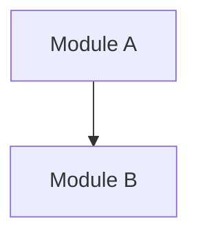

# System Context Report

**Generated On**: {{DATE}}
**Analysis Scope**: {{SCOPE}}

## Executive Summary
> [Summarize the current system state in one sentence, for example: "A generally robust Python backend, but the Auth module carries some technical debt."]

---

## 1. Component Inventory

### 1.1 Existing Components
| Component | Type | Path | Description |
|---|---|---|---|
| [Name] | [Service/UI/DB] | [Path] | [Brief description] |

### 1.2 Missing Components (Dark Matter)
> [!WARNING]
> The following components are currently missing but are critical for production readiness.

| Component | Category | Why Needed | Impact if Missing |
|---|---|---|---|
| Error Handling | Infrastructure | No unified error boundary found | Debugging will be very difficult |
| Logging | Observability | Missing structured logging | Production will be blind |
| Configuration Management | Operations | Hardcoded secrets detected | Security risk |

---

## 2. Dependency Topology

### 2.1 Build Boundaries (Build Inspector)
> [Insert findings from `build-inspector`: Build Roots, Topology, Sidecar Warnings]

### 2.2 Logical Coupling (Git Forensics)
> [Insert hotspot matrix or coupling table]

| File A | File B | Coupling | Risk |
|---|---|---|---|
| auth.py | user_db.py | 85% | HIGH |

---

## 3. Risks and Warnings

### 3.1 IPC Contract Risks (Runtime Inspector)
> [!CAUTION]
> [List weak or missing contracts in IPC interfaces found by `runtime-inspector`]

### 3.2 God Modules
> [List modules with excessively high Ca (afferent coupling)]

### 3.3 Technical Debt Hotspots
> [List files with high change frequency + high complexity]

---

## 4. Implicit Constraints (Invariant Hunter)

### 4.1 Business Invariants
> [Rules that must never be violated]
- Order total must be >= 0
- Users must complete email verification before payment

### 4.2 Assumptions
> [Assumptions present in code but not explicitly declared]
- "The network is always reliable" (no retry logic)
- "IDs are always integers"

### 4.3 Hardcoded Values
- API keys
- Timeout values

---

## 5. Concept Model (Concept Modeler)

### 5.1 Ubiquitous Language
| Term | Definition |
|---|---|
| User | Registered end-user (not an admin) |
| Order | A purchase request |

### 5.2 Data Flow
> [Describe key flows]

---

## 6. Human Checkpoint
> [!IMPORTANT]
> Before entering the Blueprint phase, confirm the following:

- [ ] Is the component inventory complete?
- [ ] Are the identified risks acceptable?
- [ ] Have all invariants been captured?
