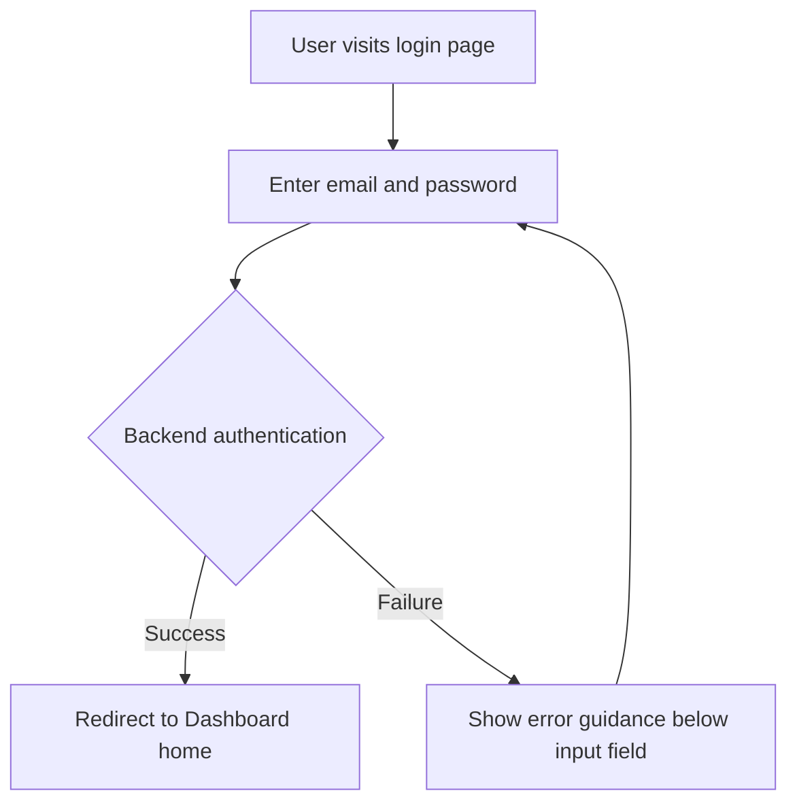

# Product Requirements Document (PRD) v2.0

**Project Name**: [Project Name]
**Feature Name**: [Feature/Requirement Name]
**Document Status**: Draft | Review | Approved
**Version**: 1.0
**Owner**: [Author Name or Agent]
**Created On**: [YYYY-MM-DD]

---

## 1. Executive Summary
<!-- Context compression: explain "why" and "what" in under 50 words. -->
<!-- ⚠️ CRITICAL: This is the elevator pitch and must stay within 50 words. -->

[Briefly describe the problem being solved and the proposed solution, focusing on core value.]

---

## 2. Background & Context
<!-- Provide sufficient business and background knowledge to support architecture and system design stages. -->

### 2.1 Problem Statement
- **Current Pain Points**: [Specific user problems today]
- **Impact Scope**: [Affected user groups/business scope]
- **Business Impact**: [Actual business impact, e.g., revenue loss, churn, low efficiency]

### 2.2 Core Opportunity
[What positive value can be created if this problem is solved? Quantify when possible.]

### 2.3 Reference & Competitors — Optional
<!-- Understand existing market solutions to avoid reinventing in mature domains. -->
- **Competitor A**: [Characteristics, pros/cons]
- **Competitor B**: [Characteristics, pros/cons]
- **Our Moat**: [Differentiation/unique value vs competitors]

---

## 3. Goals & Non-Goals

### 3.1 Goals
<!-- ⚠️ CRITICAL: Must follow SMART principles (Specific, Measurable, Achievable, Relevant, Time-bound) -->

- **[G1]**: [Measurable business goal, e.g., raise login conversion rate above 95%]
- **[G2]**: [Measurable technical goal, e.g., list page P95 load time < 1.5s]

### 3.2 Non-Goals
<!-- Explicitly define what will NOT be done; this is key to preventing scope creep. -->

- **[NG1]**: [Out-of-scope feature due to current constraints, e.g., third-party OAuth quick login]
- **[NG2]**: [Item planned for future versions, e.g., mandatory multi-factor authentication (MFA)]

---

## 4. User Stories and Requirement List
<!-- Required format: As a [role], I want [action], so that [value/benefit]. -->
<!-- ⚠️ CRITICAL: Every User Story must have a unique ID [REQ-XXX]; this is the foundation of anti-corruption and traceability. -->
<!-- ⚠️ CRITICAL: Must be ordered by user value priority (P0 core path → P1 important experience → P2 nice-to-have). -->
<!-- ⚠️ CRITICAL: Each User Story must be independently testable—after completion it should be demonstrable without depending on other stories. -->

### US-001: [Task Title] [REQ-001] (Priority: P0)

*   **Story**: As a [role], I want [feature/action], so that [benefit gained].
*   **User Value**: [One sentence on this story's core value toward the final goal]
*   **Independent Testability**: [After this task is done, how can QA/product validate it without other features?]
*   **Systems Involved**: [List system IDs involved, e.g., `frontend-system`, `backend-api` — must align with names in `02_ARCHITECTURE`]
*   **Acceptance Criteria**:
    *   [ ] **Given** [initial context], **When** [trigger action], **Then** [expected result].
    *   [ ] **Exception Handling**: When [specific exception occurs], the system must [specific fallback or prompt behavior].
*   **Boundaries and Extreme Cases**:
    *   [Boundary case 1 — e.g., very large data volume, reconnect after network loss, sudden permission changes]
    *   [Boundary case 2]

### US-002: [Task Title] [REQ-002] (Priority: P1)

*   **Story**: ...
*   **User Value**: ...
*   **Independent Testability**: ...
*   **Systems Involved**: ...
*   **Acceptance Criteria**:
    *   [ ] ...
*   **Boundaries and Extreme Cases**:
    *   ...

<!-- Continue adding User Stories based on requirement scale... -->

---

## 5. User Experience and Design — Optional
<!-- Provide key UX guidance to define boundaries for frontend/client design systems. -->

### 5.1 Key User Flows
<!-- [Recommended] Use Mermaid flowcharts to express core business flows clearly. -->

### 5.2 Design Guidelines
- **Visual Style**: [Modern, minimal, serious/professional, etc.]
- **Response Patterns**: [Requirements for loading skeletons, button loading states, etc.]
- **Platform Compatibility**: [Web only? Need mobile/tablet responsiveness?]

---

## 6. Constraints and Limits (Constraint Analysis)
<!-- Constraints define the upper bound of technical choices. Derived from /probe reports or unavoidable project constraints. -->

### 6.1 Technical Constraints
*   **Legacy Systems**: [e.g., must stay compatible with old MySQL 5.7 schema]
*   **Performance Floor**: [e.g., API P95 response time < 200ms]
*   **Scalability Expectation**: [e.g., design must support 100k concurrent online users]

### 6.2 Security & Compliance
*   **Data Security**: [e.g., logs must never include plaintext PII]
*   **Network Requirements**: [e.g., enforce site-wide HTTPS / API accessible only on intranet]
*   **Compliance Review**: [e.g., satisfy local cross-border data regulations / pass specific compliance audit]

### 6.3 Time & Resources
*   **Delivery Deadline**: [Hard deadline, e.g., full launch by 2026-03-01]
*   **Other Limits**: [e.g., integration timeline dependencies on external vendor APIs]

---

## 7. Success Metrics — Optional
<!-- How will success be measured after launch? -->

| Core Metric | Target | Measurement Method |
| ----------------- | --------------- | ----------------------------- |
| Business: Registration conversion | > 45%           | Dashboard/Funnel analysis             |
| Performance: API success rate  | > 99.9%         | APM monitoring alerts                  |

---

## 8. Definition of Done
<!-- Checklist that must be 100% checked before tasks are merged to main and released. -->

*   [ ] All acceptance criteria (AC) are fully tested and passed.
*   [ ] Sufficient automated unit tests are included (line coverage > 80%) and CI is green.
*   [ ] Integration tests/E2E critical paths are smooth.
*   [ ] Code linting and formatting checks have no warnings.
*   [ ] Relevant technical docs are updated (e.g., OpenAPI docs, Wiki knowledge base).
*   [ ] Performance and security risks have been reviewed (when related constraints apply).
*   [ ] UAT (User Acceptance Testing) has passed.

---

## 9. Appendix — Optional

### 9.1 Glossary
- **[Abbreviation/Term 1]**: [Clear definition to avoid cross-team ambiguity]
- **[Term 2]**: [Definition]

### 9.2 References
- [URL 1]
- [URL 2]

---

<!-- ⚠️ CRITICAL usage guide -->
<!-- 
**PRD Writing Principles (Lean Spec Requirements)**:
1. **Cut the noise**: Resist long essays; target under 10 minutes reading time.
2. **Executive summary < 50 words**: Explain core value with minimum words.
3. **Independence**: User story granularity must be "independently deliverable and verifiable."
4. **Traceability**: [REQ-XXX] IDs are sacred and must flow through architecture, tasks, and code.

**Section Usage Guide**:
- **Required sections**: 1, 2.1, 3, 4, 6, 8
- **Optional sections**: 2.3 (competitor analysis), 5 (UX design), 7 (success metrics), 9 (appendix)
- **Small features/iterations**: You can remove 2.3, 5, 7, 9 aggressively and keep only the skeleton.
-->
