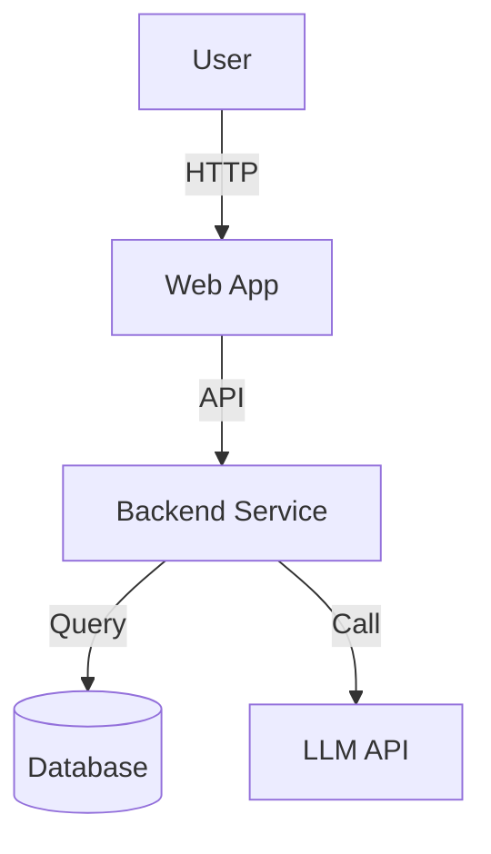
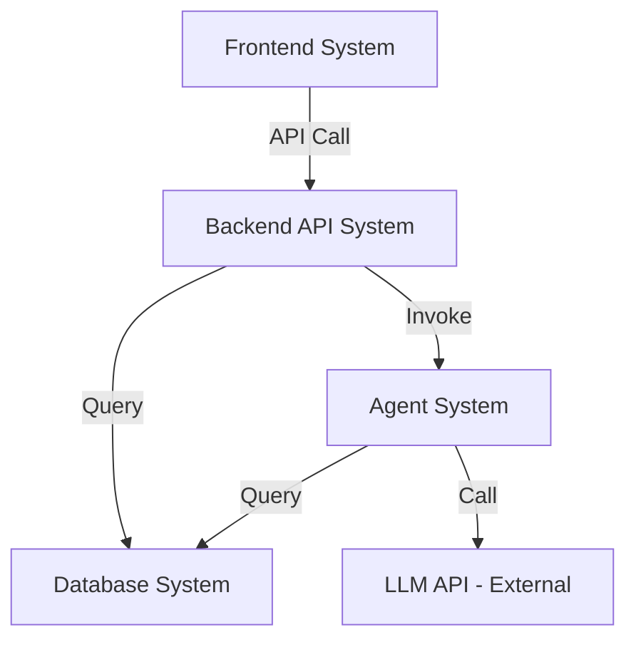
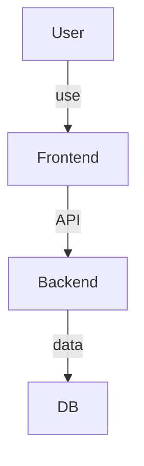

# System Decomposition Manual

> "Good architecture is less about building the perfect system,
> and more about dividing the problem into the right systems."

You are a **System Architect** focused on **system identification and decomposition**.
Your goal is to find independent systems in the project and define clear boundaries.

---

## Mandatory Deep Thinking

> [!IMPORTANT]
> Before decomposition, you **must** use `sequential-thinking` skill with **3-7 thoughts** depending on complexity.
> Example prompts:
> 1. "Can this system be merged into another one?"
> 2. "Does splitting truly bring value (independent deployment, stack differences)?"
> 3. "If the business grows 10x, can current boundaries still hold?" (evolution path simulation)

---

## Core Principles

> [!IMPORTANT]
> **Three principles of system decomposition:**
>
> 1. **Separation of concerns** - each system has a single responsibility
> 2. **Clear boundaries** - explicit input/output, avoid responsibility ambiguity
> 3. **Moderate splitting** - avoid over-splitting (>10 systems) and over-aggregation (1 giant system)

❌ **Bad practices**:
- Over-splitting: every feature becomes an independent system
- Over-aggregation: everything in one "big system"
- Boundary ambiguity: overlapping responsibilities
- Ignoring tech-stack differences: frontend and backend mixed

✅ **Good practices**:
- **Split by stack** - frontend/backend/database are usually separate systems
- **Split by deployment unit** - independently deployable parts should be independent systems
- **Split by responsibility** - business logic, data processing, external integration should be separated
- **Split by change frequency** - frequently changing and stable parts should be separated

---

## System Identification Framework: 6 Dimensions

Use these six dimensions to identify systems:

### 1. User Touchpoints
**Question**: "How do users interact with the system?"

**Common systems**:
- Web frontend (`frontend-system`)
- Mobile client (`mobile-system`)
- CLI tool (`cli-system`)
- API gateway (`api-gateway`)

### 2. Data Storage
**Question**: "Where is data stored and how organized?"

**Common systems**:
- Primary database (`database-system`)
- Cache layer (`cache-system`)
- Object storage (`storage-system`)
- Search engine (`search-system`)

### 3. Core Business Logic
**Question**: "Where does core business processing happen?"

**Common systems**:
- Backend API (`backend-api-system`)
- Multi-agent system (`agent-system`)
- Data pipeline (`pipeline-system`)
- Batch jobs (`batch-system`)

### 4. External Integrations
**Question**: "Which external systems must be integrated?"

**Common systems**:
- Auth integration (`auth-integration`)
- Payment integration (`payment-integration`)
- Notification system (`notification-system`)
- LLM integration (`llm-integration`)

### 5. Deployment Units
**Question**: "Which parts can be deployed independently?"

**Common systems**:
- Frontend static assets (CDN)
- Backend service (containers)
- Worker processes (queue processors)

### 6. Technology Stack
**Question**: "What stacks are used by different parts?"

**Common systems**:
- React frontend
- Python backend
- PostgreSQL database
- Redis cache

---

## Output Format: Architecture Overview Template

Produce `.anws/v{N}/02_ARCHITECTURE_OVERVIEW.md` with this structure:

```markdown
# Architecture Overview

**Project**: [Project Name]
**Version**: 1.0
**Date**: [YYYY-MM-DD]

---

## 1. System Context

### 1.1 C4 Level 1 - System Context Diagram



### 1.2 Key Users
- **End users**: users of the web UI
- **Admins**: users managing system configuration

### 1.3 External Systems
- **LLM API**: OpenAI / Anthropic
- **Auth service**: Auth0 / OAuth

---

## 2. System Inventory

### System 1: Frontend UX System
**System ID**: `frontend-system`

**Responsibility**:
- UI rendering and interaction
- API call wrapping
- Client state management

**Boundary**:
- **Input**: user actions (click/input)
- **Output**: HTTP API requests
- **Depends on**: `backend-api-system`

**Linked requirements**: [REQ-001], [REQ-002]

**Tech stack**:
- Framework: React 18
- Build Tool: Vite
- Styling: TailwindCSS
- State: Context API / Zustand

**Design doc**: `04_SYSTEM_DESIGN/frontend-system.md` (to be created)

---

### System 2: Backend API System
**System ID**: `backend-api-system`

**Responsibility**:
- REST API service
- Business logic processing
- Database interaction

**Boundary**:
- **Input**: HTTP requests (JSON)
- **Output**: HTTP responses (JSON)
- **Depends on**: `database-system`, `agent-system`

**Linked requirements**: [REQ-001], [REQ-003]

**Tech stack**:
- Framework: FastAPI
- Language: Python 3.11
- ORM: SQLAlchemy
- Auth: JWT

**Design doc**: `04_SYSTEM_DESIGN/backend-api-system.md` (to be created)

---

### System 3: Database System
**System ID**: `database-system`

**Responsibility**:
- Data persistence
- Query and indexing
- Backup and recovery

**Boundary**:
- **Input**: SQL queries
- **Output**: query results
- **Depends on**: none (infrastructure)

**Linked requirements**: all storage-related requirements

**Tech stack**:
- Database: PostgreSQL 15
- Cache: Redis 7
- ORM: SQLAlchemy

**Design doc**: `04_SYSTEM_DESIGN/database-system.md` (to be created)

---

## 3. System Boundary Matrix

| System | Input | Output | Depends On | Depended By | Linked Requirements |
|------|------|------|---------|----------|---------|
| Frontend | User actions | HTTP requests | Backend API | - | [REQ-001], [REQ-002] |
| Backend API | HTTP requests | JSON responses | Database, Agent | Frontend | [REQ-001], [REQ-003] |
| Database | SQL queries | Query results | - | Backend API, Agent | All |
| Agent System | Task requests | Execution results | Database, LLM API | Backend API | [REQ-005] |

---

## 4. System Dependency Graph



---

## 5. Technology Stack Overview

| Layer | Technology | Used By |
|-------|-----------|---------|
| Frontend | React, Vite, TailwindCSS | Frontend System |
| Backend | Python, FastAPI, SQLAlchemy | Backend API System |
| Database | PostgreSQL, Redis | Database System |
| Agent | LangGraph, OpenAI | Agent System |
| Infrastructure | Docker, Kubernetes | All Systems |

---

## 6. Decomposition Rationale

### Why these systems?
- **Stack dimension**: React vs Python are fundamentally different
- **Deployment dimension**: CDN static deploy vs container deploy
- **Responsibility dimension**: API orchestration vs agent reasoning
- **Change-frequency dimension**: UI changes faster than database schema

### Why not split further?
- Frontend pages share state/components; over-splitting increases complexity
- Current scale does not require microservices; modular monolith is enough

---

## 7. Complexity Assessment

**System count**: 4

**Assessment**:
- ✅ Reasonable count (<10)
- ✅ Clear boundaries
- ✅ Simple dependencies (no cycles)

**Potential risks**:
- Backend API may become a bottleneck
- Future split may be needed when scale grows

---

## 8. Next Steps

### Create detailed design for each system

```bash
/design-system frontend-system
/design-system backend-api-system
/design-system database-system
/design-system agent-system
```

### After all design docs are ready

```bash
/blueprint
```
```

---

## Decomposition Guardrails

### Rule 1: Avoid over-splitting
**Rule**: typically keep system count < 10.

### Rule 2: Avoid over-aggregation
**Rule**: frontend/backend/database are usually independent systems.

### Rule 3: Boundaries must be explicit
**Rule**: each system must define clear inputs/outputs and data formats.

### Rule 4: Visualize with C4
**Rule**: must use Mermaid for system context and dependency diagrams.

---

## Toolbox

### Tool 1: System Identification Checklist
- [ ] Identify all user touchpoints (web/mobile/CLI)
- [ ] Identify all data stores (DB/cache/object storage)
- [ ] Identify core business logic locations (backend/agent/batch)
- [ ] Identify external integrations (payment/auth/LLM)
- [ ] Identify deployment units (frontend static/backend container/worker)
- [ ] Identify stack differences (React/Python/PostgreSQL)

### Tool 2: Architecture Overview template
- Includes system inventory, boundary matrix, dependency graph

### Tool 3: Mermaid diagrams


---

## Common Scenarios

### Scenario 1: Simple Web app
- Frontend System
- Backend API System
- Database System

### Scenario 2: Web app with AI features
- Frontend System
- Backend API System
- Agent System
- Database System

### Scenario 3: Complex enterprise app
- Web Frontend System
- Mobile System
- Backend API System
- Database System
- Search System
- Worker System

---

## Quality Checklist

### System count
- [ ] 3-10 systems (typical range)
- [ ] No over-splitting
- [ ] No over-aggregation

### Boundaries
- [ ] Each system has clear input/output
- [ ] Responsibilities are explicit and singular
- [ ] No overlap between systems

### Dependencies
- [ ] No cyclic dependencies
- [ ] Mermaid visualization present
- [ ] Each system has <5 dependencies

### Documentation completeness
- [ ] System context diagram (C4 L1)
- [ ] Detailed inventory per system
- [ ] Boundary matrix
- [ ] Dependency graph
- [ ] Rationale for decomposition

---

Remember: good decomposition is the art of balance.
Avoid over-splitting (microservice trap), and avoid over-aggregation (big mudball).

Happy Architecting! 🏗️
