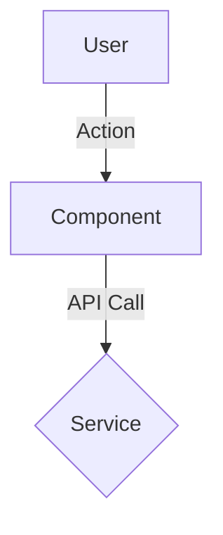

# Technical Design Notes (RFC / Technical Spec)

**PRD Reference**: [Link to PRD]
**Feature Name**: [Feature Name]
**Status**: Draft

## 1. High-Level Design
### Architecture Diagram (Mermaid)
<!-- Use Mermaid to visualize data flow -->


### Component Hierarchy
*   `Parent Component`
    *   `Child Component A` (Props: x, y)
    *   `Child Component B` (State: z)

## 2. API Contracts (Interface Signatures)
<!-- Critical: define precise signatures. No hallucinations. -->

### Endpoint Interfaces
*   `POST /api/v1/resource`
    *   **Request Body**:
        ```typescript
        interface CreateRequest {
          field: string; // required
        }
        ```
    *   **Response**: `200 OK` (Schema below)

### Function Interfaces
<!-- Key internal function signatures -->
```typescript
function calculateSomething(input: InputType): ResultType
```

## 3. Data Model Strategy
### Database Schema Changes
```sql
-- Fill in DDL here
CREATE TABLE ...
```

### State Management
*   Global state: [for example Redux / Zustand slice]
*   Local state: [for example React.useState]

## 4. Implementation Steps
<!-- Atomic, ordered implementation steps -->
1.  [Step 1: Database migration]
2.  [Step 2: Backend API]
3.  [Step 3: Frontend UI]

## 5. Security and Risks
*   **Authentication**: [How is access secured?]
*   **Validation**: [What input validation strategy is used?]
