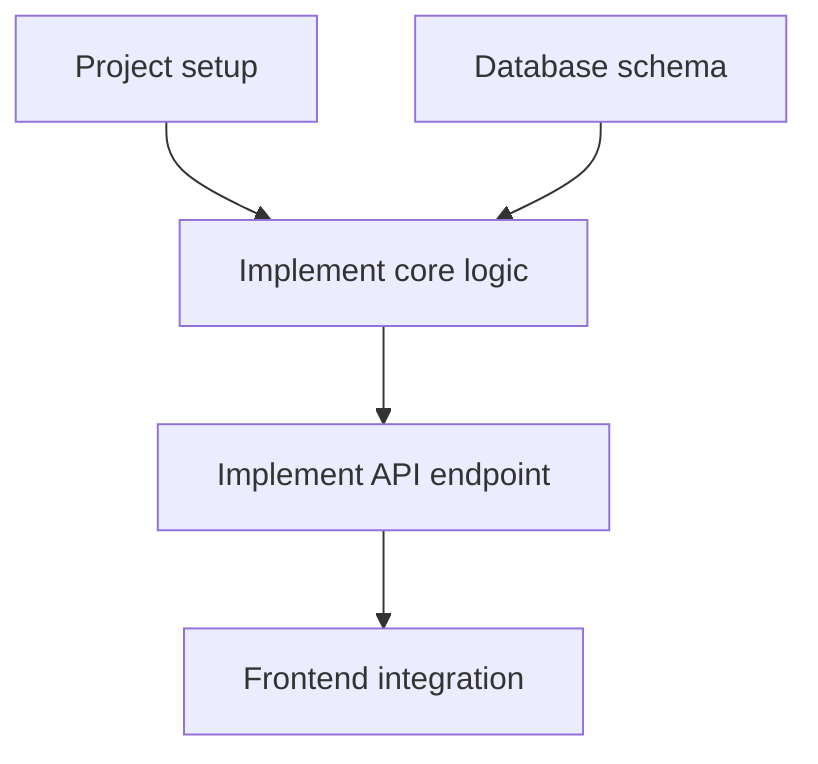

# 05A_TASKS.md Template Reference

> This file is the format reference for `05A_TASKS.md`.
> `05A` is execution-only and must not carry detailed verification design.
> Detailed verification planning belongs to `05B_VERIFICATION_PLAN.md`.

---

## Document Header

```markdown
# 05A_TASKS.md - Execution Task List

> Version: v{N}
> Generated by: /blueprint
> Last updated: {Today}
>
> Verification plan: 05B_VERIFICATION_PLAN.md (every task links through Verification Reference)
```

---

## Dependency Overview

```markdown
## Dependency Overview



```

---

## Sprint Roadmap

```markdown
## Sprint Roadmap

| Sprint | Codename | Core Tasks | Exit Criteria | Estimate |
|--------|----------|------------|---------------|----------|
| S1 | Hello World | foundation + core data | headless run succeeds + visible baseline behavior | 3-4d |
| S2 | Feature Shape | core business + APIs | complete flow is demoable | 5-6d |
```

---

## Task Structure

```markdown
- [ ] **T{System}.{Phase}.{Seq}** [REQ-XXX]: Task title
  - **Description**: what to do (not how)
  - **Input**: design references + predecessor outputs (must include at least one design-doc reference)
  - **Output**: files/components/interfaces/artifacts
  - **Contract Ownership**: contract implemented/verified by this task, or "None"
  - **Reference**: ADR / System Design section (if applicable)
  - **Acceptance Criteria**:
    - Given ...
    - When ...
    - Then ...
    - (Done When only for pure technical foundation tasks)
  - **Verification Type**: Unit Test | API Interface Functional Test | Integration Test | E2E Test | Smoke Test | Regression Test | Manual Verification | Build Check | Lint Check
  - **E2E Trigger Assumption**: if E2E is needed, define trigger conditions and key user journey (planning placeholder only; no E2E execution in blueprint/planner stage)
  - **Verification Summary**: objective and boundary only
  - **Verification Reference**: `05B_VERIFICATION_PLAN.md#t-x-y-z`
  - **Evidence Output**: `tests/...`, `reports/...`, `logs/...`, `screenshots/...`
  - **Estimate**: Xh
  - **Dependencies**: T{A}.{B}.{C}
  - **Priority**: P0 | P1 | P2
```

---

## INT Milestone Task Format

```markdown
- [ ] **INT-S{N}** [MILESTONE]: S{N} integration validation - {codename}
  - **Description**: verify sprint exit criteria and cross-system collaboration
  - **Input**: outputs of all S{N} tasks
  - **Output**: integration report (pass/fail + bug list)
  - **Acceptance Criteria**:
    - Given all S{N} tasks are complete
    - When every exit-criteria check is executed
    - Then all pass -> sprint complete; failures -> bugs recorded
  - **Verification Type**: Integration Test / Smoke Test
  - **Verification Notes**: run checks one by one, keep logs/screenshots, add minimal regression checks if needed
  - **Estimate**: 2-4h
  - **Dependencies**: all S{N} tasks
```

---

## User Story Overlay (append near end)

```markdown
## User Story Overlay

### US-001: [Title] (P0)
**Tasks**: T1.1.1 -> T1.2.1 -> T2.1.1
**Critical Path**: T1.1.1 -> T1.2.1
**Independently Testable**: Demoable by end of S1
**Coverage Status**: Complete
```

